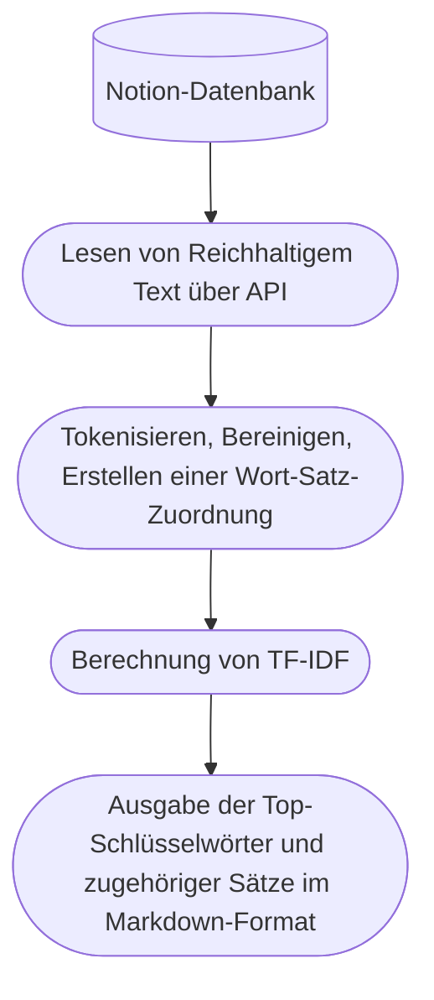

# Notion reichhaltigen Textinformationen

Lese die reichhaltigen Textinformationen aus einer Notion-Datenbank und führe eine einfache NLP-Analyse durch



## Abhängigkeiten

```shell
# python==3.8
pip install arrow ruamel.yaml tqdm pandas pyfunctional scikit-learn jieba
```

## Schnelle Verwendung

Konfigurationsdatei beziehen sich auf `config.sample.yaml` (im Folgenden config genannt)

Holen Sie sich Ihren token in [Notion Integrations](https://www.notion.so/my-integrations/), füllen Sie den token in der Konfigurationsdatei aus.

Öffnen Sie die Datenbankseite in einem Browser oder klicken Sie auf Teilen, um den Link zu kopieren, Sie können die database_id (ähnlich wie eine Reihe von Code) in der Adressleiste sehen. Geben Sie die database_id in config im Abschnitt task ein.

Extra im task dient zum Filtern und Sortieren der Datenbank, das Format und der Inhalt beziehen sich auf [Notion Filter API](https://developers.notion.com/reference/post-database-query-filter#property-filter-object). 1 Konfigurationen werden bereits in der config-Datei bereitgestellt.

Öffne das [Notebook](./notion_text_analysis.ipynb) und führe alle Zellen aus. Die Analyseergebnisse werden standardmäßig im "results"-Ordner unter dem Projektverzeichnis gespeichert.

## Probleme

- Die Genauigkeit der Jieba-Tokenisierung ist nicht hoch. Es kann durch pkuseg ersetzt werden, aber meine VPS-Konfiguration ist nicht ausreichend, um pkuseg auszuführen (Kernel gestorben), deshalb sollte es bei Bedarf durch diese Bibliothek ersetzt werden.

- Die Analysemethode von TF-IDF ist zu einfach, es ist ratsam, die API von LLM zu nutzen, um eine weitere Analyse durchzuführen (z.B. ChatGPT).