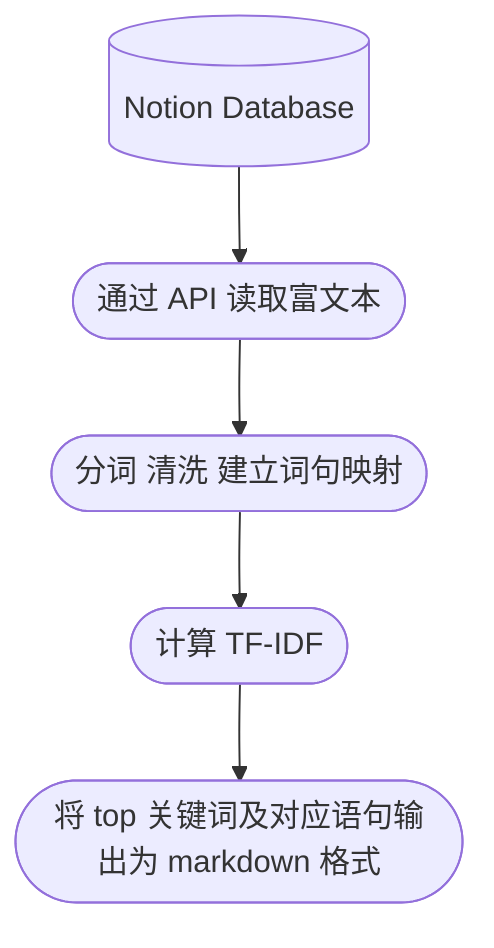

<a name="index">**Index**</a>

<a href=" 0">notion_api</a>  
&emsp;<a href="#1">依赖</a>  
&emsp;<a href="#2">快速使用</a>  
&emsp;<a href="#3">问题</a>  
# <a name="0">notion_api</a><a style="float:right;text-decoration:none;" href="#index">[Top]</a>

读取notion数据库的富文本信息，并做简单的NLP分析



## <a name="1">依赖</a><a style="float:right;text-decoration:none;" href="#index">[Top]</a>

```shell
# python==3.8
pip install arrow ruamel.yaml tqdm pandas pyfunctional scikit-learn jieba
```

## <a name="2">快速使用</a><a style="float:right;text-decoration:none;" href="#index">[Top]</a>

配置文件参照 `config.sample.yaml` (下称 config)

在 [notion integrations](https://www.notion.so/my-integrations/)获取自己的 token ，填入 config 的 token 后。

在浏览器打开 notion database 页面或点击 share 复制链接，均可在地址链接中看到 database id（类似一串乱码），填入到 config 的 task 下的 database_id。

task 的 extra 是用来筛选和排序database，格式和内容参考 [notion filter API](https://developers.notion.com/reference/post-database-query-filter#property-filter-object)。config文件已提供5种配置。

## <a name="3">问题</a><a style="float:right;text-decoration:none;" href="#index">[Top]</a>

- jieba分词的准确率不高，可以替换为pkuseg，我的VPS配置不够运行pkuseg库（kernel died），所以如果条件允许可以更换为该库。

- tf-idf的分析方法过于简单，考虑接入LLM的API来做进一步分析（例如chatGPT）。