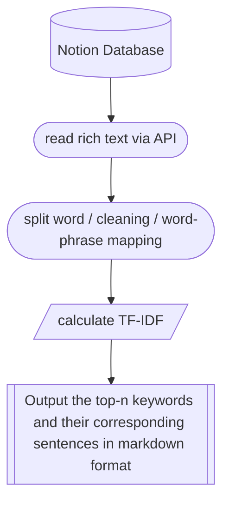

<p align="center">
  
  <h1 align="center">
    Notion Rich Text Data Analysis
  </h1>
  <p align="center">
    Read the text from a Notion database and perform NLP analysis.
  </p>
</p>

  <p align="center">
    <a href="https://github.com/dario-github/notion_rich_text_analysis/actions">
      
    </a>
    <a href="https://codecov.io/gh/dario-github/notion_rich_text_analysis">
      
    </a>
    <a href="https://github.com/dario-github/notion_rich_text_analysis/graphs/contributors">
      
    </a>
    <a href="https://github.com/dario-github/notion_rich_text_analysis">
      
    </a>
  </p>
  
  <p align="center">
    <a href="README.md">English</a>
    /
    <a href="README.zh.md">简体中文</a>
  </p>

## Introduction

When flomo first came out, a database was built in notion to implement similar functionality. It has been a few years since I recorded my thoughts and summaries, and I have accumulated some corpus. flomo's roaming function is not very suitable for my needs, so I wanted to write my own small tool to access the notion API and do NLP analysis.

Last year I wrote a demo using a notebook, but I put it on hold for a while and then improved it. Currently, it supports batch analysis tasks, you can add multiple databases and properties in the configuration file to filter the sorting criteria, and then output the keywords and the corresponding statement paragraph markdown by TF-IDF.

For example, I have added the following task myself.

- Reflections from the last year
- Summary optimisation for the year
- Self-caution for all periods
- List for the week

## Pipline

<center>



</center>

## Installation

```shell
python3.8 -m pip install notion-rich-text-analysis
```

## Quick use

Configuration file reference ``configs/config.sample.yaml`` (hereinafter config, please rename to ``config.yaml`` as your own configuration file)

### Get the integration token

In [notion integrations](https://www.notion.so/my-integrations/) create a new integration, get your own token and fill in the token in the config.yaml file afterwards.

> [graphic tutorial in tango website](https://app.tango.us/app/workflow/6e53c348-79b6-4ed3-8c75-46f5ddb996da?utm_source=markdown&utm_medium=markdown&utm_campaign=workflow%20export%20links) / [graphic tutorial in markdown format](./docs/tango/get_the_integration_token.md)

### Add integration to database/get database ID

If you open the notion database page in your browser or click on the share copy link, you will see the database id in the address link (similar to a string of jumbles) and fill in the database_id under the task of config.

> [graphic tutorial in tango website](https://app.tango.us/app/workflow/7e95c7df-af73-4748-9bf7-11efc8e24f2a?utm_source=markdown&utm_medium=markdown&utm_campaign=workflow%20export%20links) / [graphic tutorial in markdown format](./docs/tango/add_integration_to_database.md)

### Configure the filter sort database entry extra parameter

The task's extra is used to filter and sort the database, see [notion filter API](https://developers.notion.com/reference/post-database-query-filter#property-filter-object) for format and content, the `config.sample.yaml` file already provides 2 configurations.

```yaml
notion :
  token : &token 'here is your own notion intergration token'  # Obtain your own token from notion intergration: https://www.notion.so/my-integrations/
  api_version : &version '2022-06-28'  # API version
  header : # Requests header information
    Authorization : !join ['Bearer ', *token]  # The !join constructor needs to be added in python
    Notion-Version : *version 
    Content-Type : 'application/json'
task :
  - 
    run : True
    name : task_1 # Custom name for differentiation of output file
    describe : Thinking in the past year from the Memo database # Description of the current task, used to record what the task is to do
    database_id : 'here is your database id for analysis' # database id
    extra : # Options for filtering and sorting the database
      filter :
        and :
          - 
            property : Label
            multi_select :
              contains : Thinking
          - 
            timestamp : &time_key last_edited_time # created_time is also available
            *time_key : 
              past_year : {} # past_week, past_month, past_year
              # on_or_after: '2021-05-10'
  - 
    run : True
    name : task_2 # Custom name for differentiation of output file
    describe : Summary from the Memo database # Description of the current task, used to record what the task is to do
    database_id : 'here is your database id for analysis' # database id
    extra : # Options for filtering and sorting the database
      filter :
        and :
          - 
            or:
              - 
                property : Label
                multi_select : 
                  contains : summary
              - 
                property : Label
                multi_select : 
                  contains : efficency
          - 
            property : Label
            multi_select :
              does_not_contain : personal
```

### Run all tasks

```shell
# python3.8 -m notion-rich-text-analysis run-all-task --config_file ${Your Config file Path}
```

## Development

Welcome to fork and add new features/fix bugs.

- After cloning the project, use the `create_python_env_in_new_machine.sh` script to create a Poetry virtual environment.

- After completing the code development, use the invoke command to perform a series of formatting tasks, including black/isort tasks added in task.py.
  
    ```shell
    invoke check
    ```

- After submitting the formatted changes, run unit tests to check coverage.

    ```shell
    poetry run tox

    ```

## Note

- The library for Chinese word segmentation has two built-in options: jieba and pkuseg. The default is pkuseg, which has a higher memory requirement. It has been tested that a VPS with less than 1GB of memory needs to load virtual memory to use it.

- The analysis method using tf-idf is too simple. Consider integrating the API of LLM (such as chatGPT) for further analysis.

## Contributions

- scikit-learn - [https://github.com/scikit-learn/scikit-learn](https://github.com/scikit-learn/scikit-learn)

## License and Copyright

- [MIT License](./LICENSE)
  - The MIT License is a permissive open-source software license. This means that anyone is free to use, copy, modify, and distribute your software, as long as they include the original copyright notice and license in their derivative works.

  - However, the MIT License comes with no warranty or liability, meaning that you cannot be held liable for any damages or losses arising from the use or distribution of your software.

  - By using this software, you agree to the terms and conditions of the MIT License.

## Contact information

- See more at my [HomePage](https://github.com/dario-github)
