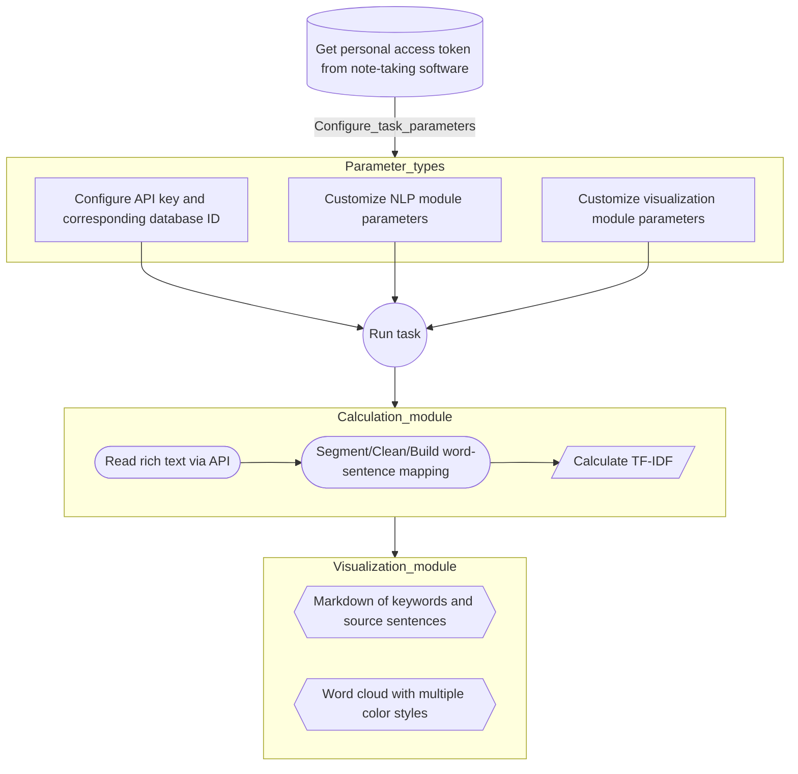

<p align="center">
  
  <h1 align="center">
    Notion NLP
  </h1>
  <p align="center">
    To read text from a Notion database and perform natural language processing analysis.
  </p>
</p>

  <p align="center">
    <a href="https://github.com/dario-github/notion-nlp/actions">
      
    </a>
    <a href="https://codecov.io/gh/dario-github/notion-nlp">
      
    </a>
    <a href="https://visitorbadge.io/status?path=https%3A%2F%2Fgithub.com%2Fdario-github%2Fnotion-nlp">
      
    </a>
    <a href="www.paypal.me/dariozhang">
      
    </a>
  </p>
  
  <p align="center">
    <a href="README.md">English</a>
    /
    <a href="README.zh.md">简体中文</a>
  </p>

## Introduction

To achieve functionality similar to flomo, I have created a database using Notion, where I have recorded my thoughts and insights over the years, accumulating a rich corpus of language. However, the random roaming feature of flomo did not meet my needs, so I decided to develop a small tool that integrates with the Notion API and performs NLP analysis.

Now, the tool can:

- Output intuitive and visually appealing word cloud images.
  
  

- Generate thematic summaries of your Notion notes.

  :memo: [Example thematic summary]((./docs/sample/English_task.top_5.md))

- Support multiple languages. I have added stopword lists for several languages including Chinese, English, Russian, French, Japanese, and German. Users can also customize their own stopword lists.

  :earth_asia: [Stopword lists for multiple languages](./resources/stopwords/)

- Support multiple tasks. Users can configure multiple databases and corresponding filtering and sorting conditions to create rich analysis tasks.

  :mag: [Example configuration file](./configs/config.sample.yaml)

  For example, I have added the following tasks:

  - :thinking: Reflections from the past year
  - :triangular_flag_on_post: Optimization of annual summaries for the current year
  - :warning: Self-admonitions from all time periods
  
I am pleased to share this tool and hope it can be helpful to you. :laughing:

## Pipline

<div style="text-align:center;">



</div>

## Installation and Usage

- Windows System

  Download [the latest release](https://github.com/dario-github/notion-nlp/releases) of the `Windows` version `zip` file, extract it, and double-click `start.bat` to follow the script prompts and start experiencing.


- Linux System
  - Method 1: Download [the latest release](https://github.com/dario-github/notion-nlp/releases) of the `Linux` version `zip` file, extract it, open the terminal in the current directory, and enter `./notion-nlp-linux --help` to view the command details.
  - Method 2: Install the package from `PyPI` to the `Python` environment.
  
    ```shell
    pip install notion-nlp
    ```

## Configure Tasks

- Configuration file reference [config.sample.yaml](./notion-nlp-dataset/configs/config.sample.yaml) (hereinafter config, please rename to ``config.yaml`` as your own configuration file)

### Get the integration token

- In [notion integrations](https://www.notion.so/my-integrations/) create a new integration, get your own token and fill in the token in the config.yaml file afterwards.

  > Graphic Tutorial: [tango](https://app.tango.us/app/workflow/6e53c348-79b6-4ed3-8c75-46f5ddb996da?utm_source=markdown&utm_medium=markdown&utm_campaign=workflow%20export%20links) / [markdown](./docs/tango/get_the_integration_token.md)

### Add integration to database/get database ID

- If you open the notion database page in your browser or click on the share copy link, you will see the database id in the address link (similar to a string of jumbles) and fill in the database_id under the task of config.

  > Graphic Tutorial: [tango](https://app.tango.us/app/workflow/7e95c7df-af73-4748-9bf7-11efc8e24f2a?utm_source=markdown&utm_medium=markdown&utm_campaign=workflow%20export%20links) / [markdown](./docs/tango/add_integration_to_database.md)

### Configure the filter sort database entry extra parameter

- The task's extra is used to filter and sort the database, see [notion filter API](https://developers.notion.com/reference/post-database-query-filter#property-filter-object) for format and content, the [config.sample.yaml](./configs/config.sample.yaml) file already provides 2 configurations.

### Run all tasks

- Select "Run all tasks" through Windows interactive script

- Call using terminal or Python code after installing the package from PyPI

  - Run from command line
  
    ```Shell
    python3.8 -m notion_nlp run-all-tasks --config-file /path/to/your/config/file
    ```

  - Run from Python code

    ```Python
    from notion_nlp import run_all_tasks
    config_file = "./notion-nlp-dataset/configs/config.yaml"
    run_all_tasks(config_file)
    ```

### Run a single task

- Select "Run specified task" through Windows interactive script
- Call using terminal or Python code after installing the package from PyPI

  - In the `run_task` command, you can specify the task in several ways, including:

    - `task`: an instance of `TaskParams`;
    - `task_json`: a JSON string representing the task information;
    - `task_name`: the name of the task.

  - If `config_file` exists, you can use `task_name` to specify the task. Note that the task needs to be activated, otherwise an exception will be thrown. If `config_file` does not exist, you need to provide a `token` and either `TaskParams` or `task_json`.

    - With an existing `config` file, pass in `task name`/`task json`/`task parameter class`

      - Run from command line

        ```shell
        # Option 1
        python3.8 -m notion_nlp run-task --task-name task_1 --config-file /path/to/your/config/file

        # Option 2
        python3.8 -m notion_nlp run-task --task-json '{"name": "task_1", "database_id": "your_database_id"}' --config-file /path/to/your/config/file
        ```

      - Run from Python code
    
        ```python
        from notion_nlp import run_task
        task_name = "task_1"
        database_id = "your_database_id"
        config_file="./configs/config.yaml"

        # Option 1
        run_task(task_name=task_name, config_file=config_file)

        # Option 2 (not recommended for Python code)
        import json
        task_info = {"name": task_name, "database_id": database_id}
        run_task(task_json=json.dumps(task_info, ensure_ascii=False), config_file=config_file)

        # Option 3 (recommended)
        from notion_nlp.parameter.config import TaskParams
        task = TaskParams(name=task_name, database_id=database_id)
        run_task(task=task, config_file=config_file)
        ```

    - Without a `config` file, pass in `token` and `task json`/`task parameter class`

      - Run from command line

        ```shell
        # Option 1
        python3.8 -m notion_nlp run-task --task-json '{"name": "task_1", "database_id": "your_database_id"}' --token 'your_notion_integration_token'
        ```

      - Run from Python code

        ```python
        from notion_nlp import run_task
        task_name = "task_1"
        database_id = "your_database_id"
        notion_token = "your_notion_integration_token"

        # Option 1 (not recommended for Python code)
        import json
        task_info = {"name": task_name, "database_id": database_id}
        run_task(task_json=json.dumps(task_info, ensure_ascii=False), token=notion_token)

        # Option 2 (recommended)
        from notion_nlp.parameter.config import TaskParams
        task = TaskParams(name=task_name, database_id=database_id)
        run_task(task=task, token=notion_token)
        ```

## Enhance Personal Experience

### :customs: Custom Stopword List

- Add a text file in the [stopwords directory](./resources/stopwords/) with the suffix `stopwords.txt`, such as `custom.stopwords.txt`. Each stopword should be on a separate line in the file.

<!--
### Deploy Your Own Lightweight App

### Subscribe to Email Notifications
-->

### :memo: Share Your Ideas with the Author

- [Join the discussion](https://github.com/dario-github/notion-nlp/discussions/new/choose)
- [Submit an issue](https://github.com/dario-github/notion-nlp/issues/new/choose)

### :gift_heart: Buy the author a cup of coffee and request a personalized customization.  


## Development

- Welcome to fork and add new features/fix bugs.

- After cloning the project, use the `create_python_env_in_new_machine.sh` script to create a Poetry virtual environment.

- After completing the code development, use the invoke command to perform a series of formatting tasks, including black/isort tasks added in task.py.
  
    ```shell
    invoke check
    ```

- After submitting the formatted changes, run unit tests to check coverage.

    ```shell
    poetry run tox

    ```

## Note

- The word segmentation tool has two built-in options: jieba/~~pkuseg~~. (Considering adding language analysis to automatically select the most suitable word segmentation tool for that language.)

  - jieba is used by default.
  - ~~pkuseg cannot be installed with poetry and needs to be installed manually with pip. In addition, this library is slow and requires high memory usage. It has been tested that a VPS with less than 1G memory needs to load virtual memory to use it.~~

- The analysis method using tf-idf is too simple. Consider integrating the API of LLM (such as openAI GPT-3) for further analysis.

## Contributions

- scikit-learn - [https://github.com/scikit-learn/scikit-learn](https://github.com/scikit-learn/scikit-learn)
- Alir3z4/stop-words - [https://github.com/Alir3z4/stop-words](https://github.com/Alir3z4/stop-words)

## License and Copyright

- [MIT License](./LICENSE)
  1. The MIT License is a permissive open-source software license. This means that anyone is free to use, copy, modify, and distribute your software, as long as they include the original copyright notice and license in their derivative works.

  2. However, the MIT License comes with no warranty or liability, meaning that you cannot be held liable for any damages or losses arising from the use or distribution of your software.

  3. By using this software, you agree to the terms and conditions of the MIT License.

## Contact information

- See more at my [HomePage](https://github.com/dario-github)
