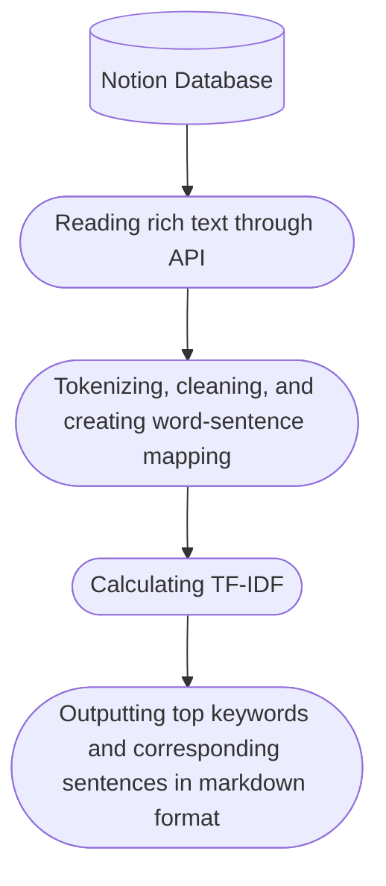

[](https://codecov.io/gh/dario-github/notion_rich_text_analysis)


[English](./README.md) / [Deutsch](./README.de.md) / [简体中文](./README.zh.md)

# notion rich text analysis

Reading rich text information from a Notion database and performing simple NLP analysis.



## Dependencies

```shell
# python==3.8
pip install arrow ruamel.yaml tqdm pandas pyfunctional scikit-learn jieba
```

## Quick Start

Reference the config.sample.yaml file (referred to as the config file) for configuration.

Get your own token from [notion integrations](https://www.notion.so/my-integrations/), and enter it in the token field in the config file.

To obtain the database ID, either open the notion database page in a browser or copy the link after clicking the "share" button. The database ID (a string of random characters) can be found in the address link. Enter it in the database_id field under the task field in the config file.

The extra field in the task is used to filter and sort the database. The format and content can be referred to [notion filter API](https://developers.notion.com/reference/post-database-query-filter#property-filter-object). The config file provides 1 configurations.

Open the [notebook](./notion_text_analysis.ipynb) and run all cells. The analysis results are stored in the "results" folder under the project directory by default.

## Issues

- Jieba tokenization may not be accurate, and it can be replaced with pkuseg. However, my VPS configuration is not enough to run the pkuseg library (kernel died), so if conditions permit, it can be changed to that library.

- The TF-IDF analysis method is too simple, and it is considered to connect to the LLM API for further analysis (such as chatGPT)."
