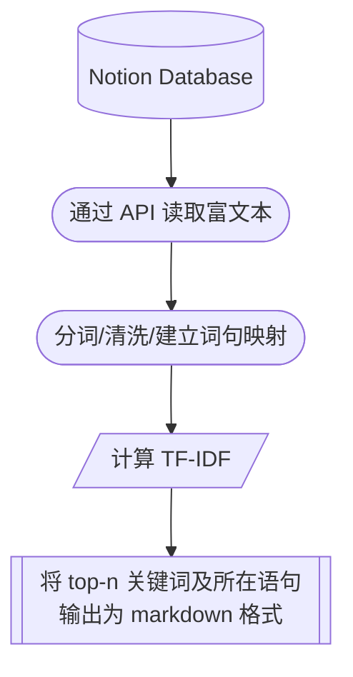

<p align="center">
  
  <h1 align="center">
    Notion NLP
  </h1>
  <p align="center">
    从Notion数据库中读取文本并进行自然语言处理分析。
  </p>
</p>

  <p align="center">
    <a href="https://github.com/dario-github/notion-nlp/actions">
      
    </a>
    <a href="https://codecov.io/gh/dario-github/notion-nlp">
      
    </a>
    <a href="https://github.com/dario-github/notion-nlp/graphs/contributors">
      
    </a>
    <a href="https://visitorbadge.io/status?path=https%3A%2F%2Fgithub.com%2Fdario-github%2Fnotion-nlp">
      
    </a>
  </p>
  
  <p align="center">
    <a href="README.md">English</a>
    /
    <a href="README.zh.md">简体中文</a>
  </p>

## 简介

flomo刚出时，在notion建了一个database用来实现类似功能。记录思考和总结已经好几年了，很是积累了一些语料。flomo的漫游功能做的不是很合乎我的需求，于是想自己写一个接入notion API然后做NLP分析的小工具。

去年用notebook写了demo，乱七八糟的事太多搁置了，前不久加以完善。目前支持批量分析任务，可以在配置文件添加多个database和properties筛选排序条件，然后按TF-IDF输出关键词和相应语句段落的markdown。

例如我自己添加了以下任务：

- 近一年的思考
- 本年度总结优化
- 所有时段的自我告诫
- 本周清单

## Pipline

<div style="text-align:center;">



</div>

## 安装

```shell
python3.8 -m pip install notion-nlp
```

## 快速使用

配置文件参照 `configs/config.sample.yaml` (下称 config, 请改名为`config.yaml`作为自己的配置文件)

### 获取integration的token

在 [notion integrations](https://www.notion.so/my-integrations/)新建一个integration，获取自己的 token ，填入 config.yaml 文件的 token 后。

> [tango网页版图文教程](https://app.tango.us/app/workflow/6e53c348-79b6-4ed3-8c75-46f5ddb996da?utm_source=markdown&utm_medium=markdown&utm_campaign=workflow%20export%20links) / [markdown格式图文教程](./docs/tango/get_the_integration_token.zh.md)

### 将integration添加到database/获取database ID

在浏览器打开 notion database 页面或点击 share 复制链接，均可在地址链接中看到 database id（类似一串乱码），填入到 config 的 task 下的 database_id。

> [tango网页版图文教程](https://app.tango.us/app/workflow/7e95c7df-af73-4748-9bf7-11efc8e24f2a?utm_source=markdown&utm_medium=markdown&utm_campaign=workflow%20export%20links) / [markdown格式图文教程](./docs/tango/add_integration_to_database.zh.md)

### 配置筛选排序数据库条目的extra参数

task 的 extra 是用来筛选和排序 database，格式和内容参考 [notion filter API](https://developers.notion.com/reference/post-database-query-filter#property-filter-object)。[config.sample.yaml](./configs/config.sample.yaml) 文件已提供2种配置。


### 执行所有任务

```shell
python3.8 -m notion-nlp run-all-task --config-file ${Your Config file Path}
```

## 开发

欢迎 fork 并 添加功能/修复bug。

- clone 项目后使用`create_python_env_in_new_machine.sh`脚本创建 poetry 虚拟环境。

- 完成代码开发后，使用invoke命令做一系列格式化，`task.py`已添加`black`/`isort`等任务。

    ```shell
    invoke check
    ```

- 提交格式化的修改后，做单元测试，查看覆盖率情况。

    ```shell
    poetry run tox
    ```

## 问题

- 分词工具内置了两种：jieba/pkuseg。（考虑加入语种解析，自动选用该语种最适合的分词工具）
  - 默认使用jieba；
  - pkuseg用poetry无法安装，需要手动pip安装，另外该库速度很慢，对内存要求较高，实测低于1G内存的VPS需要加载虚拟内存才能使用。

- tf-idf的分析方法过于简单，考虑接入LLM的API来做进一步分析（例如chatGPT）。

## 贡献

- scikit-learn - [https://github.com/scikit-learn/scikit-learn](https://github.com/scikit-learn/scikit-learn)

## 许可证与版权

- [MIT License](./LICENSE)

  - MIT许可证是一种宽松的开源软件许可证。这意味着任何人都可以自由地使用、复制、修改和分发您的软件，只要他们在其派生作品中包括原始版权声明和许可证。

  - 然而，MIT许可证不提供任何保证或责任，这意味着您不会对使用或分发您的软件而产生的任何损害或损失负责。

  - 通过使用这个软件，您同意接受MIT许可证的条款和条件。

## 联系方式

- 详见 [HomePage](https://github.com/dario-github)
