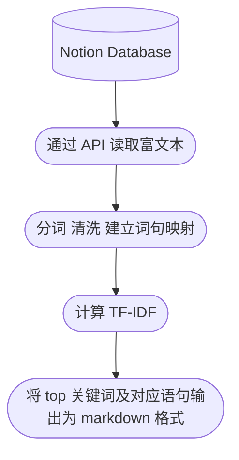

[](https://github.com/dario-github/notion_rich_text_analysis/actions/workflows/main.yml)
[](https://codecov.io/gh/dario-github/notion_rich_text_analysis)
[](#)


[English](./README.md) / [Deutsch](./README.de.md) / [简体中文](./README.zh.md) 

# notion 富文本数据分析

读取notion数据库的富文本信息，并做简单的NLP分析



## 依赖

```shell
# python==3.8
pip install arrow ruamel.yaml tqdm pandas pyfunctional scikit-learn jieba
```

## 快速使用

配置文件参照 `config.sample.yaml` (下称 config, 请改名为`config.yaml`)

在 [notion integrations](https://www.notion.so/my-integrations/)获取自己的 token ，填入 config 的 token 后。

在浏览器打开 notion database 页面或点击 share 复制链接，均可在地址链接中看到 database id（类似一串乱码），填入到 config 的 task 下的 database_id。

task 的 extra 是用来筛选和排序database，格式和内容参考 [notion filter API](https://developers.notion.com/reference/post-database-query-filter#property-filter-object)。config文件已提供1种配置。

打开 [notebook](./notion_text_analysis.ipynb)，运行所有单元。分析结果默认存放在项目目录下的 results 文件夹。

## 开发

完成代码开发后，格式化
```shell
invoke check
```

提交格式化的修改后，做单元测试，查看覆盖率情况
```shell
poetry run tox
```

## 问题

- jieba分词的准确率不高，可以替换为pkuseg，我的VPS配置不够运行pkuseg库（kernel died），所以如果条件允许可以更换为该库。

- tf-idf的分析方法过于简单，考虑接入LLM的API来做进一步分析（例如chatGPT）。