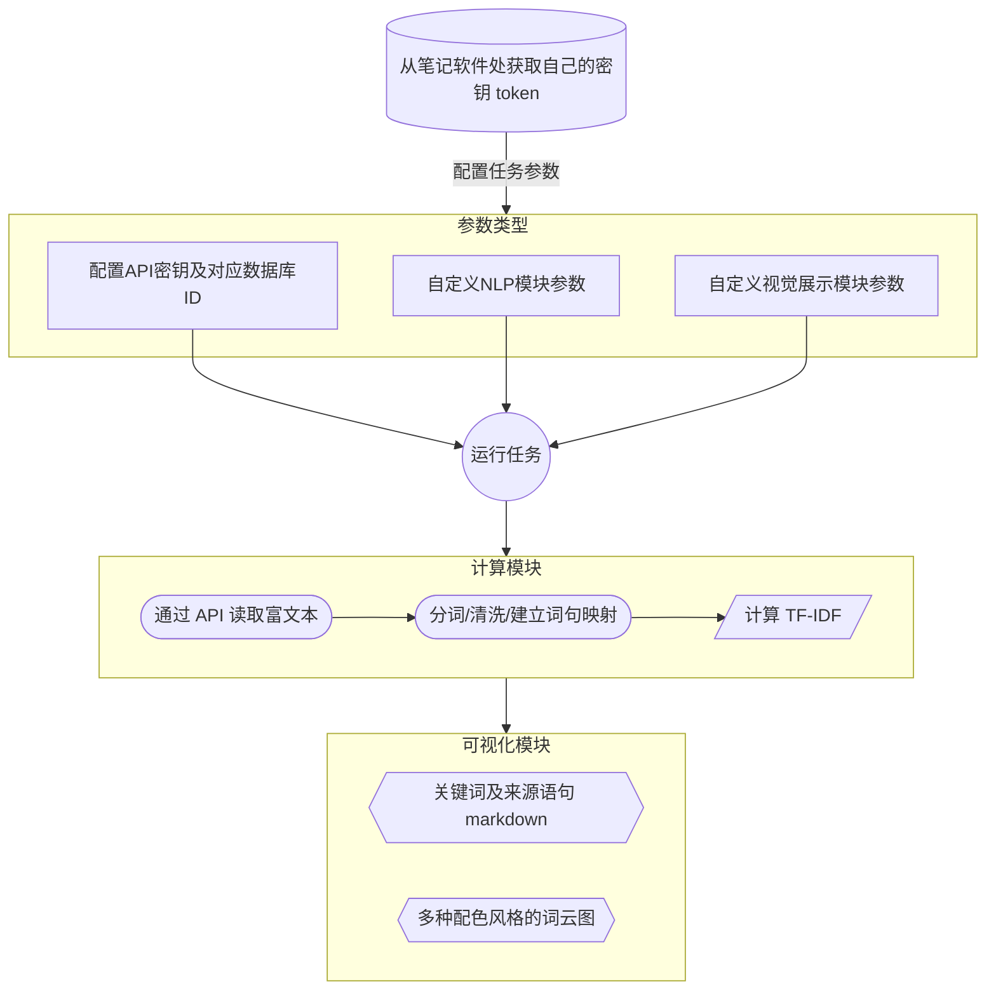

<p align="center">
  
  <h1 align="center">
    Notion NLP
  </h1>
  <p align="center">
    从Notion数据库中读取文本并进行自然语言处理分析。
  </p>
</p>

  <p align="center">
    <a href="https://github.com/dario-github/notion-nlp/actions">
      
    </a>
    <a href="https://codecov.io/gh/dario-github/notion-nlp">
      
    </a>
    <a href="https://visitorbadge.io/status?path=https%3A%2F%2Fgithub.com%2Fdario-github%2Fnotion-nlp">
      
    </a>
    <a href="www.paypal.me/dariozhang">
      
    </a>
  </p>
  
  <p align="center">
    <a href="README.md">English</a>
    /
    <a href="README.zh.md">简体中文</a>
  </p>

## 简介

为了实现flomo类似的功能，我使用notion建立了一个database，并记录了多年来的思考和总结，积累了丰富的语料库。然而，flomo的随机漫游不能满足我的需求，因此我决定开发一个小工具，接入notion API并进行NLP分析。

现在，它可以:

- 输出直观、酷炫的词云图
  
  

- 为你的notion笔记生成一份主题总结
  
  :memo: [主题总结样例](./docs/zh_unit_testing_task.tf_idf.analysis_result.top5_word_with_sentences.md)

- 支持多语种。添加了中英俄法日德等语种的停用词表，也可自定义停用词表。
  
  :earth_asia: [多语种停用词](./resources/stopwords/)

- 支持多任务。用户可以在配置文件中添加多个数据库和对应筛选排序条件来组成丰富的分析任务。

  :mag: [配置文件样例](./configs/config.sample.yaml)

  例如，可以添加以下任务：

  - :thinking: 近一年的思考
  - :triangular_flag_on_post: 本年度总结优化
  - :warning: 所有时段的自我告诫

现在，我很高兴能够分享这个工具，希望它能够为您提供帮助 :laughing:

## 流程

<div style="text-align:center;">



</div>

## 安装与使用

- Windows系统

  下载最新zip文件，解压缩后双击start.bat

```shell
python3.8 -m pip install notion-nlp
```

## 自定义参数文件

- 配置文件参照 [config.sample.yaml](./configs/config.sample.yaml) (下称 config, 建议重命名为`config.yaml`作为自己的配置文件)

### 获取integration的token

- 在 [notion integrations](https://www.notion.so/my-integrations/)新建一个integration，获取自己的 token ，填入 config.yaml 文件的 token 后。

  > 图文教程：[tango网页版](https://app.tango.us/app/workflow/6e53c348-79b6-4ed3-8c75-46f5ddb996da?utm_source=markdown&utm_medium=markdown&utm_campaign=workflow%20export%20links) / [markdown格式](./docs/tango/get_the_integration_token.zh.md)

### 将integration添加到database/获取database ID

- 在浏览器打开 notion database 页面或点击 share 复制链接，均可在地址链接中看到 database id（类似一串乱码），填入到 config 的 task 下的 database_id。

  > 图文教程：[tango网页版](https://app.tango.us/app/workflow/7e95c7df-af73-4748-9bf7-11efc8e24f2a?utm_source=markdown&utm_medium=markdown&utm_campaign=workflow%20export%20links) / [markdown格式](./docs/tango/add_integration_to_database.zh.md)

### 配置筛选排序数据库条目的extra参数

- task 的 extra 是用来筛选和排序 database，格式和内容参考 [notion filter API](https://developers.notion.com/reference/post-database-query-filter#property-filter-object)。[config.sample.yaml](./configs/config.sample.yaml) 文件已提供2种配置。


### 执行所有任务

- 通过命令行执行

  ```shell
  python3.8 -m notion_nlp run-all-tasks --config-file 您的配置文件路径
  ```

- 通过 Python 调用

  ```python
  from notion_nlp import run_all_tasks
  config_file = "./configs/config.yaml"
  run_all_tasks(config_file)
  ```

### 执行单个任务

- 在run_task命令中，支持多种方式来指定任务，包括：

  - task；参数类；
  - task_json：任务信息json字符串；
  - task_name：任务名。

- 如果config_file存在，则可以使用task_name进行指定，同时还需要满足任务为激活状态，否则会抛出异常。如果config_file不存在，则需要提供token和参数类或任务信息json字符串中的任意一种。

  - 已有`config`文件，传入`task name`/`task json`/`task 参数类`
  
    - 通过命令行执行

      ```shell
      # 方式一
      python3.8 -m notion_nlp run-task --task-name task_1 --config-file 您的配置文件路径

      # 方式二
      python3.8 -m notion_nlp run-task --task-json '{"name": "task_1", "database_id": "your_database_id"}' --config-file 您的配置文件路径
      ```

    - 通过 Python 调用

      ```python
      from notion_nlp import run_task
      task_name = "task_1"
      database_id = "your_database_id"
      config_file="./configs/config.yaml"

      # 方式一
      run_task(task_name=task_name, config_file=config_file)

      # 方式二（不推荐用于 Python 调用）
      import json
      task_info = {"name": task_name, "database_id": database_id}
      run_task(task_json=json.dumps(task_info, ensure_ascii=False), config_file=config_file)

      # 方式三（推荐）
      from notion_nlp.parameter.config import TaskParams
      task = TaskParams(name=task_name, database_id=database_id)
      run_task(task=task, config_file=config_file)
      ```

  - 没有`config`文件，传入`token`和`task json`/`task 参数类`

    - 通过命令行执行

      ```shell
      # 方式一
      python3.8 -m notion_nlp run-task --task-json '{"name": "task_1", "database_id": "your_database_id"}' --token '您的 Notion Integration Token'
      ```

    - 通过 Python 调用

      ```python
      from notion_nlp import run_task
      task_name = "task_1"
      database_id = "your_database_id"
      notion_token = "your_notion_integration_token"

      # 方式一（不推荐用于 Python 调用）
      import json
      task_info = {"name": task_name, "database_id": database_id}
      run_task(task_json=json.dumps(task_info, ensure_ascii=False), token=notion_token)

      # 方式二（推荐）
      from notion_nlp.parameter.config import TaskParams
      task = TaskParams(name=task_name, database_id=database_id)
      run_task(task=task, token=notion_token)
      ```

## 增强个人体验

### :customs: 自定义停用词表
- 在 [stopwords目录](./resources/stopwords/) 添加文本文件，后缀为`stopwords.txt`既可，如`custom.stopwords.txt`，文件内停用词每行一个。

<!--
### 部署自己的轻应用

### 订阅邮件推送
-->

### :memo: 跟作者聊聊你的想法

- [参与讨论](https://github.com/dario-github/notion-nlp/discussions/new/choose) 
- [提交问题](https://github.com/dario-github/notion-nlp/issues/new/choose)

### :gift_heart: 加入贡献者名单 


## 开发

- 欢迎 fork 并 添加功能/修复bug。

- clone 项目后使用`create_python_env_in_new_machine.sh`脚本创建 poetry 虚拟环境。

- 完成代码开发后，使用invoke命令做一系列格式化，`task.py`已添加`black`/`isort`等任务。

    ```shell
    invoke check
    ```

- 提交格式化的修改后，做单元测试，查看覆盖率情况。

    ```shell
    poetry run tox
    ```

## 问题

- 分词工具内置了两种：jieba/pkuseg。（考虑加入语种解析，自动选用该语种最适合的分词工具）
  - 默认使用jieba；
  - pkuseg用poetry无法安装，需要手动pip安装，另外该库速度很慢，对内存要求较高，实测低于1G内存的VPS需要加载虚拟内存才能使用。

- tf-idf的分析方法过于简单，考虑接入LLM的API来做进一步分析（例如chatGPT）。

## 贡献

- scikit-learn - [https://github.com/scikit-learn/scikit-learn](https://github.com/scikit-learn/scikit-learn)
- Alir3z4/stop-words - [https://github.com/Alir3z4/stop-words](https://github.com/Alir3z4/stop-words)

## 许可证与版权

- [MIT License](./LICENSE)

  1. MIT许可证是一种宽松的开源软件许可证。这意味着任何人都可以自由地使用、复制、修改和分发您的软件，只要他们在其派生作品中包括原始版权声明和许可证。

  2. 然而，MIT许可证不提供任何保证或责任，这意味着您不会对使用或分发您的软件而产生的任何损害或损失负责。

  3. 通过使用这个软件，您同意接受MIT许可证的条款和条件。

## 联系方式

- 详见 [HomePage](https://github.com/dario-github)
